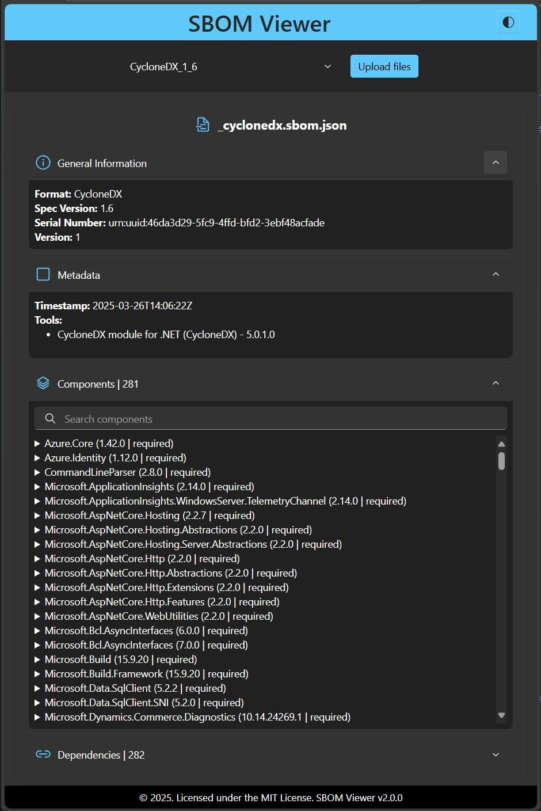

# SPDX & CycloneDX JSON Viewer
*A modern web-based viewer for SPDX & CycloneDX SBOMs.*

[**SBOM Viewer**](https://sbomviewer.com)

<div align="center">
  
</div>

SBOM Viewer is a web application built with Blazor WebAssembly that provides an interactive, user-friendly interface for viewing and exploring parsed SPDX and CycloneDX JSON files.

It loads data directly in the browser and presents it in a structured, hierarchical format—making it easy to analyze software components, licenses, and dependencies without additional tools.

## Supported Formats

| Format | Versions |
|--------|----------|
| CycloneDX | 1.6, 1.7 |
| SPDX | 2.2 |

The format and version are **auto-detected** from the uploaded JSON file—no manual selection required. Unsupported versions are rejected with a clear error message.

## Latest Release

**Version 3.0.0** – Dynamic UI engine, CycloneDX 1.7 & auto-detect

- **Dynamic rendering pipeline** — replaced hardcoded format-specific viewers and parsers with a JSON-driven UI that generates the display directly from the uploaded file structure
- **CycloneDX 1.7** support with lifecycles, tags, OmniBOR IDs, SWHIDs, standards, declarations, and formulation
- **Auto-detect format** — upload any supported SBOM JSON and the viewer identifies the format and version automatically
- **Performance** — removed NJsonSchema dependency; schema inference now runs in microseconds via direct `JsonElement` traversal
- **SEO** — added `robots.txt` and `sitemap.xml`
- Unsupported versions show a clear error with the list of supported formats
- Removed manual format selector dropdown for a simpler upload experience

For the complete history of changes, see [CHANGELOG.md](./CHANGELOG.md).

## Installation

1. Clone the repository:
   ```bash
   git clone https://github.com/NavneetHegde/SBOMViewer.git
   ```

2. Navigate to the project directory:
   ```bash
   cd SBOMViewer
   ```

3. Restore the dependencies:
   ```bash
   dotnet restore
   ```

4. Run the application:
   ```bash
   dotnet run --project SBOMViewer.Blazor
   ```

   This will launch the app in your browser at `https://localhost:5157`.

## Usage

1. Open the app and click **Upload SBOM**.
2. Select a `.json` file (max 20 MB) — the format is detected automatically.
3. The data is parsed and displayed in a structured, searchable view.
4. Navigate through accordion sections to explore components, dependencies, licenses, and more.

### Sample Files

The [`samples/`](./samples/) folder contains ready-to-use SBOM files for testing:

| File | Format | Purpose |
|------|--------|---------|
| `cyclonedx-1.6-minimal.json` | CycloneDX 1.6 | Minimal — 3 components |
| `cyclonedx-1.6-full.json` | CycloneDX 1.6 | Full — 8 components, hashes, authors, external refs |
| `cyclonedx-1.7-full.json` | CycloneDX 1.7 | Full — lifecycles, tags, OmniBOR, SWHID, standards, declarations, formulation |
| `cyclonedx-1.5-unsupported.json` | CycloneDX 1.5 | Negative test — triggers unsupported version error |
| `spdx-2.2-minimal.json` | SPDX 2.2 | Minimal — 3 packages |
| `spdx-2.2-full.json` | SPDX 2.2 | Full — 7 packages, checksums, external refs |

## Technology Stack

- **Blazor WebAssembly** — client-side UI, no backend required
- **C# / .NET 10** — application logic and JSON parsing (`System.Text.Json`)
- **Fluent UI** (`Microsoft.FluentUI.AspNetCore.Components` v4.13.2) — modern UI components
- **Azure Static Web Apps** — hosting and deployment

## Project Structure

```
SBOMViewer.sln
├── SBOMViewer.Blazor/          # Main Blazor WASM project
│   ├── Components/             # UploadFile, DynamicSbomViewer, DynamicSection, DynamicObject
│   ├── Models/                 # SbomFormat, SchemaNode
│   ├── Services/               # SchemaService, SbomState, SbomFormatDetector
│   ├── Pages/                  # Home page
│   └── Layout/                 # MainLayout (header, toolbar, footer)
├── SBOMViewer.Blazor.Tests/    # xUnit + FluentAssertions test suite
├── samples/                    # Sample SBOM JSON files
└── docs/                       # Design docs and plans
```

## Contributing

We welcome contributions to improve the project! Feel free to fork the repository, open issues, or submit pull requests.

## License

This project is licensed under the MIT License - see the [LICENSE](LICENSE) file for details.

## Acknowledgements

- Thanks to the Blazor community for providing the framework that makes this project possible.
- [CycloneDX](https://cyclonedx.org/) and [SPDX](https://spdx.dev/) for the SBOM specifications.
